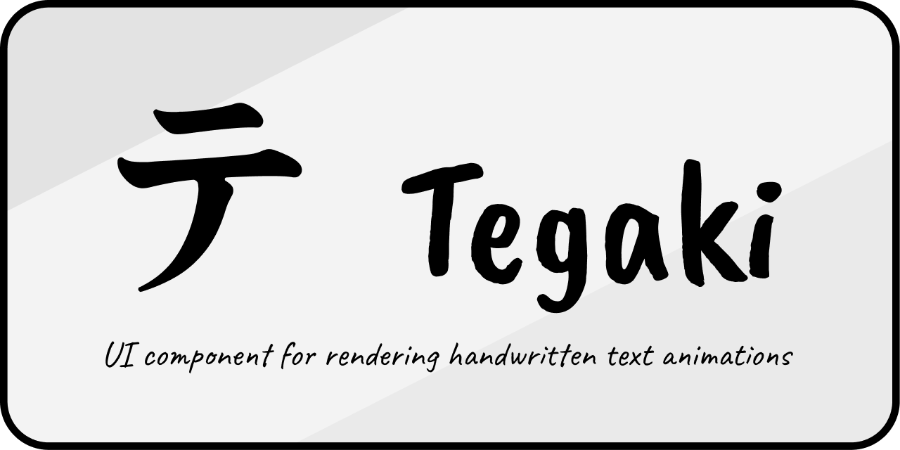

<p align="center">
  
</p>

<h3 align="center">Handwriting animation for any font</h3>

<p align="center">
  Tegaki (手書き) generates stroke data from fonts and renders animated handwriting in React.<br />
  No manual path authoring. No native dependencies. Just pick a font.
</p>

<p align="center">
  <a href="https://www.npmjs.com/package/tegaki"></a>
  <a href="https://github.com/KurtGokhan/tegaki/blob/main/LICENSE"></a>
</p>

---

## How it works

**1. Generate** a font bundle from any Google Font (or a local `.ttf`):

```bash
npx @tegaki/generator generate "Caveat"
```

Each glyph is run through a processing pipeline — flatten bezier curves, rasterize, skeletonize via Zhang-Suen thinning, trace polylines, compute stroke widths via distance transform, determine stroke order — and the result is a set of animated SVGs with timing data.

**2. Render** the animated text in React:

```tsx
import { TegakiRenderer } from 'tegaki';
import font from './output/caveat/glyphs.ts';

await font.registerFontFace();

function App() {
  return (
    <TegakiRenderer font={font} style={{ fontSize: '48px' }}>
      Hello World
    </TegakiRenderer>
  );
}
```

The text draws itself stroke by stroke, with accurate widths and natural timing.

## Install

```bash
npm install tegaki
```

The generator is a separate package, only needed at build time:

```bash
npm install -D @tegaki/generator
```

## `<TegakiRenderer>` props

| Prop | Type | Default | Description |
|------|------|---------|-------------|
| `font` | `TegakiBundle` | — | Font bundle with animated glyph SVGs |
| `text` | `string` | — | Text to animate (or pass as `children`) |
| `children` | `string \| number` | — | Text content, coerced to string |
| `time` | `number` | — | Controlled mode: current time in seconds |
| `defaultTime` | `number` | `0` | Uncontrolled mode: starting time |
| `speed` | `number` | `1` | Playback speed multiplier |
| `playing` | `boolean` | `true` | Whether animation is playing |
| `loop` | `boolean` | `false` | Restart when animation ends |
| `onTimeChange` | `(time: number) => void` | — | Called each frame with current time |
| `onComplete` | `() => void` | — | Called when animation reaches the end |
| `showOverlay` | `boolean` | `false` | Show debug text overlay |

Plus all standard `<div>` props (`className`, `style`, etc.).

### Controlled vs. uncontrolled

By default, `TegakiRenderer` manages its own playback — it auto-plays on mount and responds to `speed`, `playing`, and `loop`.

Pass `time` to take control yourself. The component renders the exact frame for that timestamp, which is useful for syncing animation with scroll position, a slider, or streaming text.

```tsx
// Uncontrolled — just works
<TegakiRenderer font={font} speed={2} loop>Hello</TegakiRenderer>

// Controlled — you drive it
<TegakiRenderer font={font} time={currentTime}>Hello</TegakiRenderer>
```

### `computeTimeline(text, font)`

Returns timing info for a string without rendering anything:

```ts
import { computeTimeline } from 'tegaki';

const { entries, totalDuration } = computeTimeline('Hello', font);
// totalDuration: 2.45 (seconds)
// entries: [{ char: 'H', offset: 0, duration: 0.52, hasSvg: true }, ...]
```

## Generating font bundles

```bash
npx @tegaki/generator generate [family] [options]
```

| Option | Description | Default |
|--------|-------------|---------|
| `family` | Google Fonts family name | `Caveat` |
| `-o, --output` | Output directory | `output/<family>` |
| `-r, --resolution` | Bitmap resolution for skeletonization | `400` |
| `-c, --chars` | Characters to process | printable ASCII |
| `-f, --force` | Re-download cached font | `false` |
| `-d, --debug` | Write intermediate visualizations | `false` |
| `-l, --lineCap` | Stroke cap style (`auto`/`round`/`butt`/`square`) | `auto` |
| `--skeletonMethod` | Algorithm (`zhang-suen` / `guo-hall` / `lee` / `medial-axis` / `thin` / `voronoi`) | `zhang-suen` |

Output structure:

```
output/caveat/
  font.json        # Full glyph data (coordinates, strokes, timing)
  caveat.ttf       # Original font file
  glyphs.ts        # Import this in your app
  svg/
    A.svg          # Animated SVG per glyph
    A.tsx          # React component per glyph
    ...
```

Import `glyphs.ts` — it bundles all glyph components and font metadata into a `TegakiBundle`.

## Pipeline

The entire processing pipeline is pure TypeScript — no canvas, no native image libraries, no Python. It runs identically in Node/Bun and in the browser.

```
Font file
  → Flatten bezier curves to polylines
  → Rasterize to binary bitmap (scanline fill, nonzero winding)
  → Skeletonize to 1px-wide skeleton (Zhang-Suen thinning)
  → Trace skeleton into polylines (spur pruning + RDP simplification)
  → Compute stroke width at each point (distance transform)
  → Order strokes top-to-bottom, left-to-right
  → Generate animated SVG with per-stroke timing
```

## Packages

| Package | npm | Description |
|---------|-----|-------------|
| [`tegaki`](packages/renderer) | [](https://www.npmjs.com/package/tegaki) | React component for animated handwriting |
| [`@tegaki/generator`](packages/generator) | [](https://www.npmjs.com/package/@tegaki/generator) | CLI that generates font bundles |
| [`@tegaki/website`](packages/website) | — | Interactive preview app |

## Contributing

```bash
bun install          # Install dependencies
bun dev              # Start dev server (website)
bun start            # Run the CLI (generator)
bun checks           # Lint + typecheck + tests
```

## License

[MIT](LICENSE)
